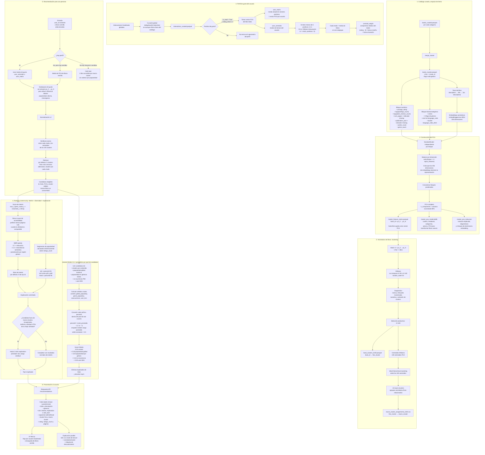

# Diagrama de flujo: recomendación de libros

Este diagrama documenta el flujo implementado: catálogo → PCA → clústeres → perfiles de usuario → ranking → API/UI.

## Notas de lectura

- Los clústeres se forman con el espacio PCA completo porque representan vecindarios eficientes de libros. La afinidad de ranking excluye `pc_0` a `pc_5` para reducir la influencia directa de popularidad, idioma y metadatos faltantes.
- Los percentiles se usan de dos formas: `p25` y `p90` segmentan popularidad para exploración (`tail`, `mid`, `head`); y V1.2 convierte cada señal de su pool de candidatos a percentil antes de combinarla.
- La popularidad no excluye libros ni ordena los slots de interés del ranking content-only. Solo rige los slots de exploración y puede actuar como señal calibrada en el ranking híbrido.
